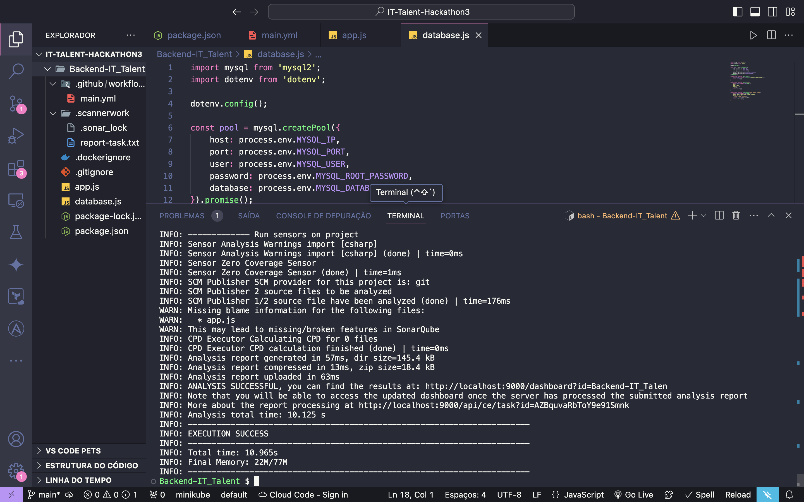
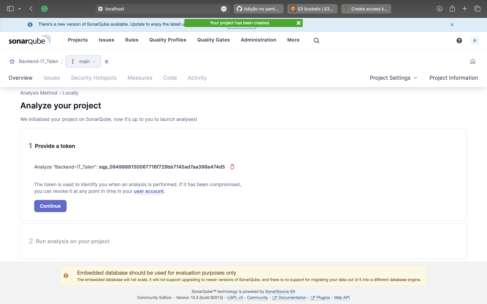
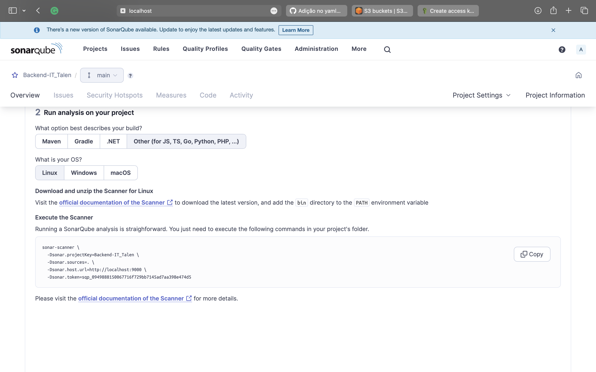
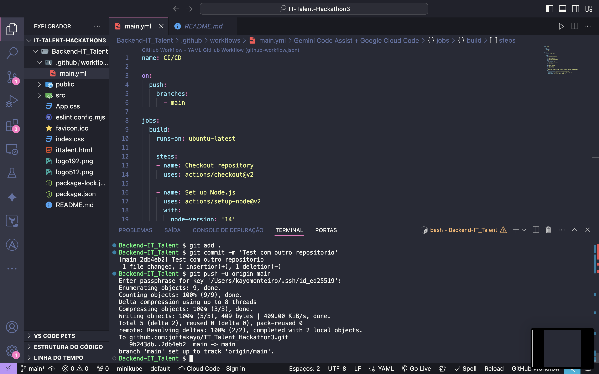
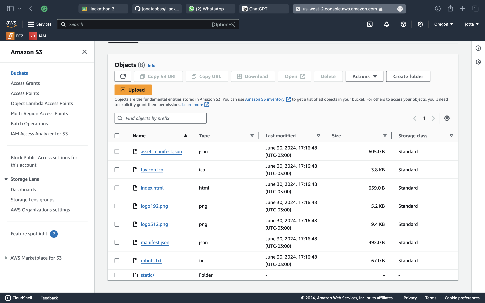
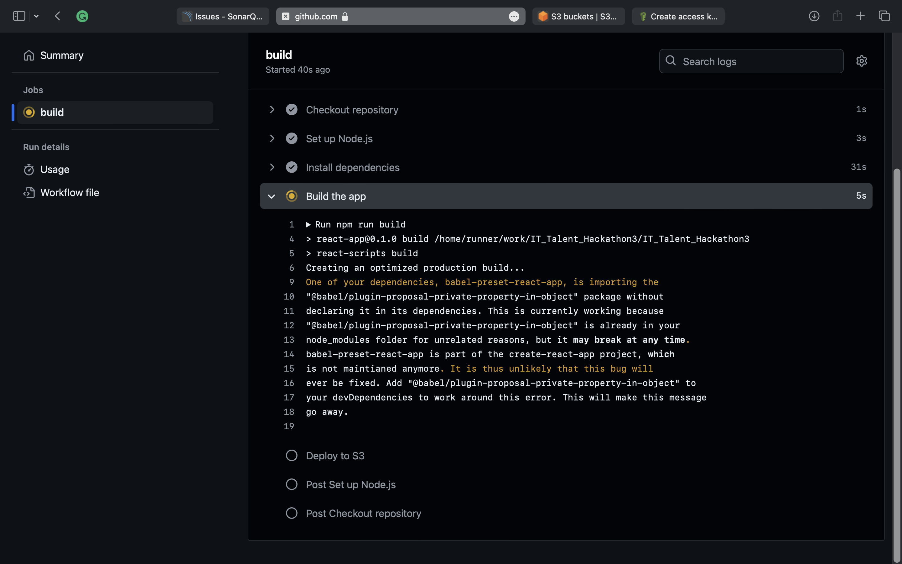
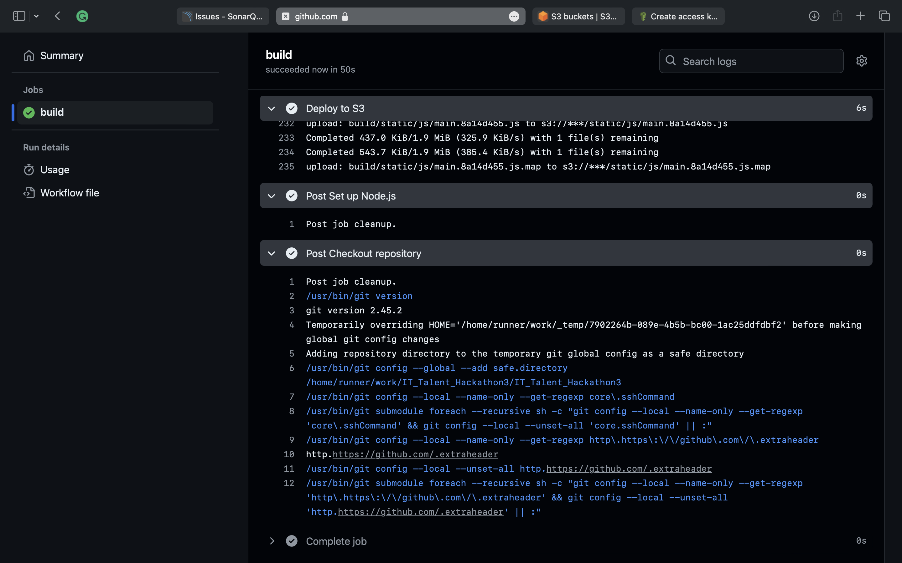
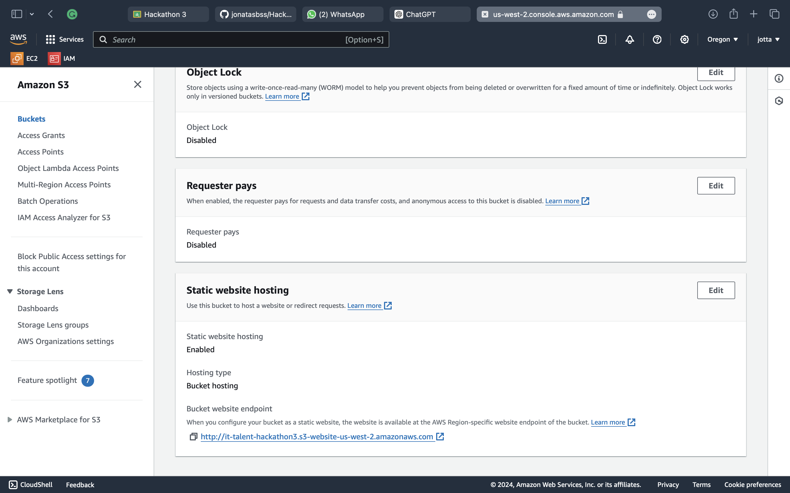
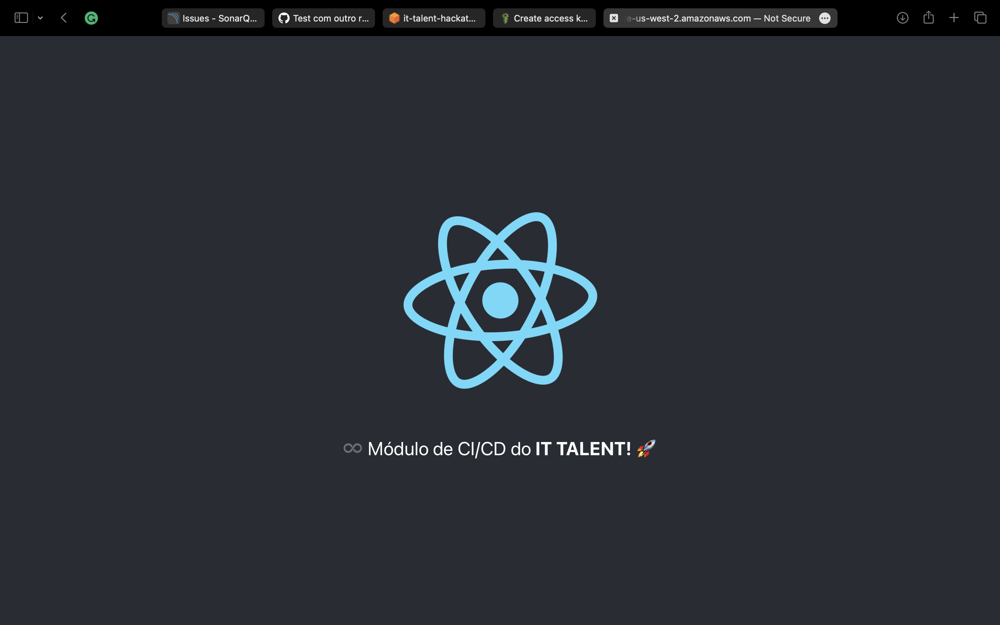

# IT TALENT – TURMA DEVOPS 2024 – 3º HACKATHON

## Introdução

Vamos de hackathon! Esse é o 3º Hackathon do IT Talent! 😃 Neste desafio, vamos usar ferramentas como Docker, GitHub Actions, AWS e SonarQube. Bora!

## Objetivo

O objetivo desse hackathon é configurar e usar o SonarQube para analisar nosso código e montar um pipeline de CI/CD para uma aplicação React. Tudo automatizado, com build e deploy na AWS. Show.

### Atividade 1: SonarQube

1. Primeiro, clonei o repositório [Backend-IT_Talent](https://github.com/moisesAlc/Backend-IT_Talent).
2. Depois, configurei e rodei o SonarQube num contêiner Docker.
3. Usei o SonarScanner CLI para analisar o código do repositório clonado.

### Atividade 2: CI/CD com GitHub Actions e AWS

1. Criei um workflow no GitHub Actions para fazer o build de uma aplicação React.
2. Subi o build gerado para um bucket S3 na AWS, deixando acessível publicamente.

## Entregáveis

Para completar o hackathon, aqui estão as imagens e links:

### Atividade 1: SonarQube

1. 
2. 
3. 

### Atividade 2: CI/CD com GitHub Actions e AWS

1. 
2. 
3. 
2. 
3. 
3. 

---